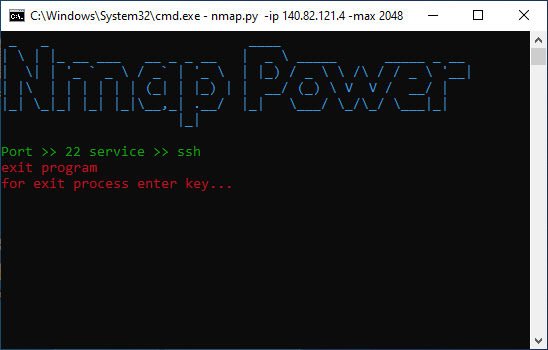

# Nmap - Python 3.8
<ul>
  <li> <a href="https://docs.python.org/3/library/socket.html">socket</a> </li>
  <li> <a href="https://docs.python.org/3/library/threading.html">threading</a> </li>
  <li> <a href="https://docs.python.org/3/library/argparse.html?highlight=argparse#module-argparse">argparse</a> </li>
  <li> <a href="https://docs.python.org/3/library/platform.html?highlight=platform#module-platform">platform</a> </li>
  <li> <a href="https://pypi.org/project/pyfiglet/">pyfiglet</a> </li>
  <li> <a href="https://pypi.org/project/colorama/">colorama</a> </li> 
  <li> <a href="https://docs.python.org/3/library/time.html?highlight=time#module-time">time</a> </li>
  <li> <a href="https://docs.python.org/3/library/os.html?highlight=os#module-os">os</a> </li>
</ul>

 This previous one will undergo improvements This is a beta version 
  I developed for scanning open ports on networks All 
  you have to do is follow the instructions
 

 

  <kbd > git clone https://github.com/ClickCyber/Nmap </kbd> 
  <kbd > cd Nmap </kbd> 
  <kbd > pip install requirements.txt </kbd> 
  <kbd > python nmap.py -ip {ip addres} -max {max port scan} </kbd>
  
  

  
  

  
  
  
  <h4> Thanks You Stay follow</h4>
